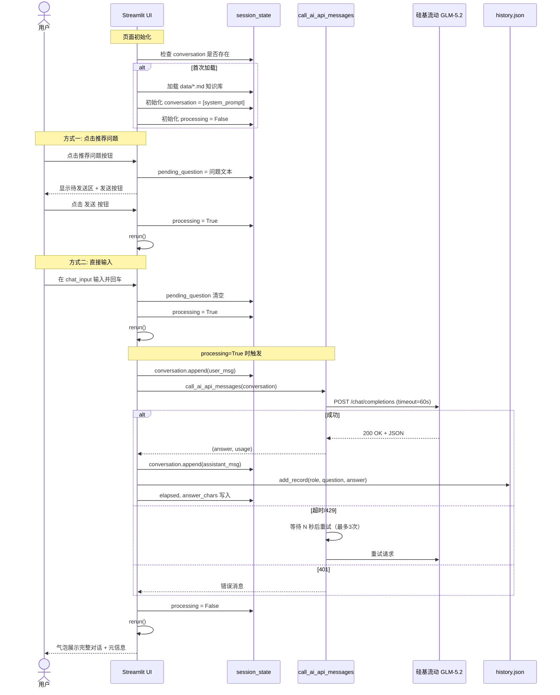
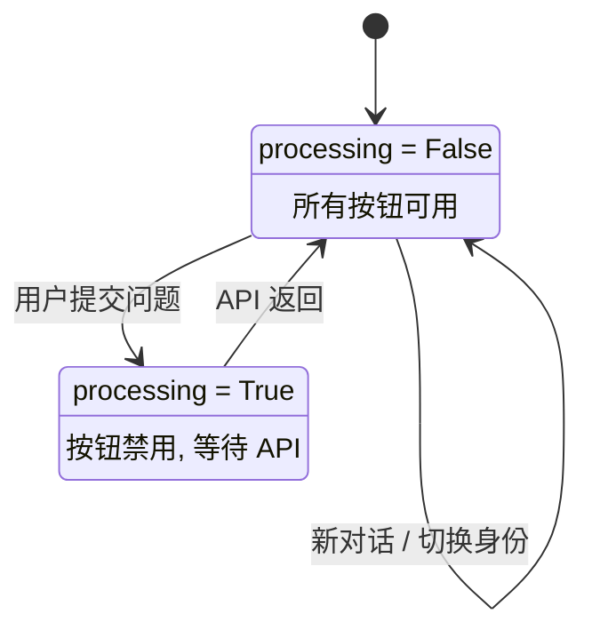

# 小航 · 郑州航院校园信息查询 AI 助手 —— 设计文档

> 版本：v2.0 | 日期：2026-07-16 | 作者：小航开发组

***

## 一、系统架构设计

### 1.1 整体架构

```
┌─────────────────────────────────────────────┐
│                 用户浏览器                  │
│            (Streamlit WebSocket)            │
└─────────────────┬───────────────────────────┘
                  │
┌─────────────────▼───────────────────────────┐
│              Streamlit 前端层               │
│  ┌─────────┐ ┌──────────┐ ┌─────────────┐  │
│  │ 左侧边栏  │ │ 对话主区域 │ │ 页脚/兜底区域 │  │
│  │·身份选择  │ │·对话气泡  │ │·电话黄页     │  │
│  │·推荐问题  │ │·chat_input│ │·版权信息     │  │
│  │·历史记录  │ │·元信息展示 │ │              │  │
│  └─────────┘ └──────────┘ └─────────────┘  │
└─────────────────┬───────────────────────────┘
                  │
┌─────────────────▼───────────────────────────┐
│              Python 业务逻辑层              │
│  ┌──────────┐ ┌──────────┐ ┌────────────┐  │
│  │prompts.py│ │ api.py   │ │history.py  │  │
│  │·身份分流  │ │·HTTP调用  │ │·JSON持久化  │  │
│  │·硬规则    │ │·重试机制  │ │·增删查导出  │  │
│  │·别名映射  │ │·429处理  │ │            │  │
│  └──────────┘ └────┬─────┘ └────────────┘  │
│                    │                         │
└────────────────────┼─────────────────────────┘
                     │ HTTPS
┌────────────────────▼─────────────────────────┐
│         硅基流动 API (SiliconFlow)          │
│          GLM-5.2 Chat Completions           │
└──────────────────────────────────────────────┘
```

### 1.2 模块依赖关系

| 模块               | 依赖                                   | 说明                      |
| ---------------- | ------------------------------------ | ----------------------- |
| `src/app.py`     | `prompts.py`, `api.py`, `history.py` | 主程序，编排所有模块              |
| `src/api.py`     | `config.py`                          | API 调用需要配置参数            |
| `src/prompts.py` | `data/*.md`                          | 读取知识库文件构建 system prompt |
| `src/history.py` | `data/history.json`                  | 读写历史记录 JSON 文件          |

### 1.3 文件职责

| 文件               | 职责        | 输入                     | 输出                                               |
| ---------------- | --------- | ---------------------- | ------------------------------------------------ |
| `src/config.py`  | 集中配置管理    | 无                      | API\_URL, API\_KEY, MODEL, TIMEOUT, MAX\_RETRIES |
| `src/prompts.py` | Prompt 工程 | 用户角色, 知识库文本            | 完整 system prompt 字符串                             |
| `src/api.py`     | API 通信    | messages 列表            | (answer\_str, usage\_dict)                       |
| `src/history.py` | 历史持久化     | role, question, answer | JSON 文件读写                                        |
| `src/app.py`     | UI 主程序    | 用户交互                   | Streamlit 页面                                     |
| 根 `app.py`       | 独立入口      | 同上（内联所有逻辑）             | 同上                                               |

***

## 二、交互流程设计

### 2.1 用户提问完整时序图（核心流程）



### 2.2 预设问题交互

点击推荐问题不会直接发送，而是先显示在待发送区供用户确认：

| 步骤 | 用户操作               | 系统行为                                       |
| -- | ------------------ | ------------------------------------------ |
| 1  | 点击推荐问题按钮           | `pending_question` 存入 session\_state，rerun |
| 2  | 看到蓝色提示框 + 发送按钮     | 用户可以改为点其他推荐问题，或直接打字覆盖                      |
| 3a | 点击「发送」             | 设置 `processing=True`，正式提交问题                |
| 3b | 直接在 chat\_input 输入 | 清空 `pending_question`，提交新问题                |
| 4  | —                  | 进入 API 调用流程                                |

### 2.3 多轮对话状态流转

会话有三种状态，由 `processing` 标志和 `conversation` 列表控制：

| 状态                  | 触发条件               | 表现                                           |
| ------------------- | ------------------ | -------------------------------------------- |
| **Idle（就绪）**        | `processing=False` | 所有按钮可用，等待用户输入                                |
| **Processing（处理中）** | `processing=True`  | 按钮禁用，显示 spinner，等待 API 返回                    |
| **Reset（重置）**       | 点「新对话」或切换身份        | conversation 清空为初始 `[system_prompt]`，回到 Idle |

切换身份时，如果 system prompt 内容变化，conversation 自动重置；如果没变则保持。

### 2.4 历史记录操作

| 操作   | 触发方式        | 实现                                           |
| ---- | ----------- | -------------------------------------------- |
| 自动保存 | 每次 Q\&A 成功后 | `add_record()` → `history.json`              |
| 列表展示 | 页面渲染        | 左侧栏倒序显示，每条显示时间+身份+问题前20字                     |
| 查看详情 | 点击条目        | `view_history` 存入 session\_state，右侧展开完整问答    |
| 关闭详情 | 点击 ✖        | 清空 `view_history`                            |
| 清空全部 | 点击「清空历史记录」  | `clear_history()` 清空 JSON，按钮 processing 期间禁用 |
| 导出全部 | 点击「导出全部历史」  | 生成 Markdown 文件下载，按钮 processing 期间禁用          |
| 导出当前 | 回答区「导出最后回答」 | 仅导出最近一次 Q\&A                                 |

***

## 三、UI 布局设计

### 3.1 页面布局总览

```
┌──────────────────────────────────────────────────────────┐
│            [校徽] 小航 · 郑州航院校园信息助手            │
│  基于 Streamlit + 硅基流动大模型 API | 更新：2026-07-16  │
├──────────────────┬───────────────────────────────────────┤
│  左侧栏 (1/3)     │  右侧主区域 (2/3)                       │
│                  │                                       │
│  👤 身份选择      │  ┌─ user ──────────────────────────┐  │
│                  │  │ 宿舍是几人间？                     │  │
│  💡 推荐问题      │  ├─ assistant ─────────────────────┤  │
│  [标签页切换]     │  │ 龙子湖校区有4人间和6人间...        │  │
│  报到先去哪？     │  └────────────────────────────────┘  │
│  宿舍几人间？     │                                       │
│  ...             │  💡 报到那天先去哪？           [发送]   │
│                  │  💬 有什么想问的？_________________     │
│  ─────────────── │                                       │
│  📋 历史记录      │  [🆕 新对话]  [📥 导出最后回答]         │
│  [导出全部] [清空]│  回答字数: 156字 · 耗时: 2.3秒          │
│  07-16 宿舍...   │  ─────────────────────────────────    │
│  07-16 校园卡    │  📞 电话黄页（静态兜底，可折叠）         │
├──────────────────┴───────────────────────────────────────┤
│       郑州航空工业管理学院人工智能专业认知实习项目       │
└──────────────────────────────────────────────────────────┘
```

### 3.2 左侧栏组件清单

| 组件      | Streamlit API        | 说明                      |
| ------- | -------------------- | ----------------------- |
| 身份选择器   | `st.selectbox`       | 新生/在校生/教师，切换时自动重置对话     |
| 推荐问题标签页 | `st.tabs` × 3        | 新生指南(4)、办事流程(6)、应急防骗(4) |
| 标签页内按钮  | `st.button` × 14     | 点击存入 `pending_question` |
| 导出全部历史  | `st.download_button` | 生成 .md 下载               |
| 清空历史    | `st.button`          | 清空 JSON 并刷新             |
| 历史条目列表  | `st.button` × N      | 倒序排列，点击展开详情             |

### 3.3 右侧组件清单

| 组件     | Streamlit API                     | 说明                      |
| ------ | --------------------------------- | ----------------------- |
| 对话气泡   | `st.chat_message` + `st.markdown` | 遍历 conversation 列表渲染    |
| 预设问题确认 | `st.info` + `st.button`           | pending\_question 存在时显示 |
| 问题输入   | `st.chat_input`                   | 直接输入即发送                 |
| 新对话    | `st.button`                       | 重置 conversation         |
| 导出当前   | `st.download_button`              | 导出最后一条 Q\&A             |
| 元信息    | `st.caption`                      | 字数 + 耗时 + Token 消耗      |
| 电话黄页   | `st.expander` + `st.markdown`     | 静态表格，9 行关键号码            |

***

## 四、状态管理设计

### 4.1 session\_state 状态表

| 键名                 | 类型          | 初始值                   | 说明            | 生命周期     |
| ------------------ | ----------- | --------------------- | ------------- | -------- |
| `school_info`      | str         | load\_school\_info()  | 拼接后的知识库文本     | 整个会话     |
| `conversation`     | list\[dict] | \[{role:system, ...}] | 多轮对话 messages | 整个会话，可重置 |
| `history`          | list\[dict] | load\_history()       | 历史记录列表        | 整个会话     |
| `processing`       | bool        | False                 | 请求处理锁         | 提问→回答之间  |
| `question`         | str         | ""                    | 当前待发送问题       | 每次提问更新   |
| `pending_question` | str         | None                  | 预设问题待确认       | 点击推荐→发送间 |
| `last_answer`      | str         | None                  | 最后一条 AI 回答    | 每次回答更新   |
| `last_usage`       | dict        | None                  | 最后 Token 消耗   | 每次回答更新   |
| `elapsed`          | float       | 0                     | 最后 API 耗时     | 每次回答更新   |
| `answer_chars`     | int         | 0                     | 最后回答字数        | 每次回答更新   |
| `view_history`     | dict        | None                  | 当前查看的历史条目     | 点击→关闭间   |

### 4.2 状态流转图



### 4.3 处理锁触发条件

| 操作                     | processing=False |   processing=True   |
| ---------------------- | :--------------: | :-----------------: |
| 发送预设问题 / chat\_input   |       正常触发       | `st.warning("请稍候")` |
| 清空历史 / 导出 / 新对话 / 查看历史 |       正常执行       | 按钮 disabled（灰色不可点击） |

***

## 五、API 调用设计

### 5.1 请求构造

```python
# 请求体（多轮对话携带完整 messages 列表）
{
    "model": "zai-org/GLM-5.2",
    "messages": [
        {"role": "system", "content": "<完整 system prompt>"},
        {"role": "user", "content": "宿舍几人间？"},
        {"role": "assistant", "content": "龙子湖校区有4人间和6人间..."},
        {"role": "user", "content": "有空调吗？"}   # AI 理解上下文
    ],
    "temperature": 0.3,
    "max_tokens": 1024
}
```

### 5.2 System Prompt 组装顺序

```
身份语气  →  别名词典  →  6条硬规则  →  学校资料  →  完整 system prompt
```

### 5.3 异常处理策略

| 异常类型            | 重试次数 | 等待时间    | 重试后仍失败             |
| --------------- | :--: | ------- | ------------------ |
| 200 成功          |   —  | —       | 返回 (answer, usage) |
| Timeout 超时      |  2 次 | 每次 2s   | 返回 "AI 响应超时"       |
| 429 限流          |  2 次 | 3s → 6s | 返回 "请求过于频繁"        |
| 401 密钥失效        |  0 次 | —       | 返回 "密钥失效，联系老师"     |
| ConnectionError |  0 次 | —       | 返回 "网络连接失败"        |
| JSON 解析异常       |  0 次 | —       | 返回 "返回格式异常"        |

### 5.4 重试参数

| 参数           | 值      | 说明             |
| ------------ | ------ | -------------- |
| TIMEOUT      | 60s    | HTTP 超时        |
| MAX\_RETRIES | 2      | 额外重试次数，共 3 次尝试 |
| 超时间隔         | 2s     | 固定等待           |
| 429 间隔       | 3s, 6s | 第1次等3s，第2次等6s  |

***

## 六、数据加载设计

### 6.1 知识库加载

```python
def load_school_info():
    files = list(Path("data").glob("*.md"))  # 通配符读取，新增文件零改动
    parts = []
    for f in sorted(files):
        parts.append(f"=== {f.name} ===\n{f.read_text()}")
    return "\n\n".join(parts)
```

| 特性   | 实现                              |
| ---- | ------------------------------- |
| 文件发现 | `Path("data").glob("*.md")` 通配符 |
| 排序方式 | 按文件名（`01_`, `02_` 前缀保证顺序）       |
| 容错   | 文件缺失返回"数据文件缺失"提示                |
| 扩展性  | 新增 .md 无需改任何代码                  |

### 6.2 历史记录持久化

| 项目   | 说明                                   |
| ---- | ------------------------------------ |
| 写入时机 | 每次 API 成功返回后                         |
| 写入方式 | 全量读写 JSON（append 模式）                 |
| 存储位置 | `data/history.json`                  |
| 编码格式 | UTF-8, ensure\_ascii=False, indent=2 |
| 读取时机 | 页面首次加载 + 每次写入后刷新                     |

***

## 七、Prompt 工程设计

### 7.1 身份分流策略

| 身份  | 语气风格           | 回答重点          |
| --- | -------------- | ------------- |
| 新生  | 热心学长，详细口语化，多鼓励 | 流程讲清楚、提醒注意事项  |
| 在校生 | 老司机学长，简洁直接     | 地点→电话→材料→办结时间 |
| 教师  | 专业礼貌，用"您"      | 政策依据→办事窗口→联系人 |

### 7.2 别名词典（8 组）

| 类别   | 别名数量 | 示例                     |
| ---- | ---- | ---------------------- |
| 学校名称 | 4    | 航院、ZUA、郑航 → 郑州航空工业管理学院 |
| 校区名称 | 4    | 龙湖 → 龙子湖校区；大学路 → 大学路校区 |
| 校园设施 | 3    | 饭卡、校卡 → 校园一卡通          |
| 部门名称 | 3    | 保安、门卫 → 保卫处            |
| 办事术语 | 4    | 迁户口 → 户籍迁入/迁出          |

### 7.3 6 条硬规则

| # | 规则                                     | 目的     |
| - | -------------------------------------- | ------ |
| 1 | 只能根据资料回答，没有的说"我没收录，建议拨打 0371-61911000" | 防幻觉    |
| 2 | 严禁编造电话号码、地址、时间、金额、人名                   | 防编造    |
| 3 | 涉及金钱/转账，无条件提示防骗警告                      | 防骗底线   |
| 4 | 涉及心理危机，立即给援助热线 + 心理咨询 + 告诉辅导员          | 心理危机兜底 |
| 5 | 不接入学校系统，个人查询类拒绝                        | 边界声明   |
| 6 | 回答末尾标注 \[来源:文件名]                       | 来源可溯   |

***

## 八、目录结构

```
xiaohang_helper/
├── .streamlit/config.toml      # 工具栏最小化
├── assets/logo.png             # 郑航校徽
├── data/
│   ├── 01_新生入学.md
│   ├── 02_办事流程.md
│   ├── 03_电话黄页.md
│   ├── 04_应急防骗.md
│   ├── 05_交通出行.md
│   └── history.json            # 运行时生成
├── src/
│   ├── app.py                  # Streamlit 主程序
│   ├── api.py                  # API 调用（重试/429处理）
│   ├── config.py               # 配置管理
│   ├── prompts.py              # Prompt 工程
│   └── history.py              # 历史记录持久化
├── app.py                      # 独立版入口
└── requirements.txt
```

***

> 本文档描述小航 AI 助手的系统设计、交互流程和模块架构。代码实现详见 `src/` 目录。

