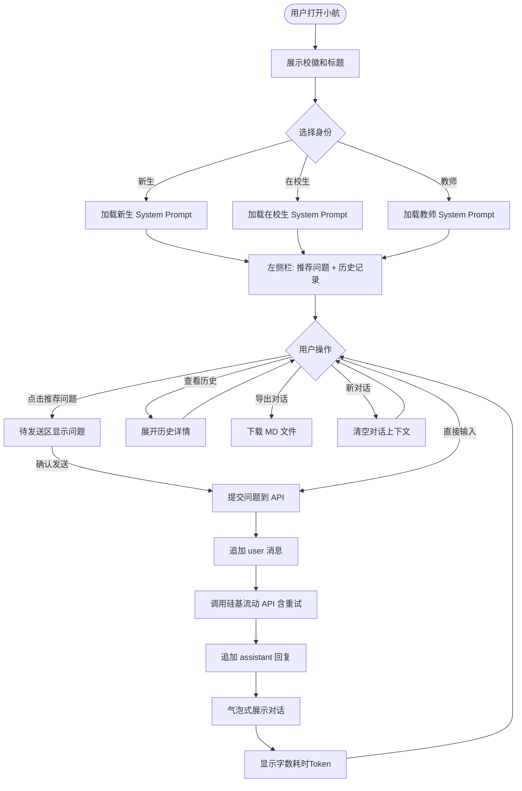

# "小航"校园信息查询 AI 助手 - 项目需求分析文档

> 课程：郑州航空工业管理学院 人工智能专业大一认知实习 · 第6天
> 日期：2026-07-16
> 项目：小航 · 郑州航院校园信息查询 AI 助手（最终版）

***

## 一、项目概述

**项目名称：** 小航——郑州航院校园信息查询 AI 助手

**项目目标：** 为郑州航院师生提供智能校园信息查询服务，覆盖新生入学、办事流程、电话黄页、应急防骗、交通出行五大场景。基于 Prompt 工程 + 硅基流动大模型 API + Streamlit 前端，支持多轮对话、历史记录持久化、对话导出等功能。

**技术栈：**

| 技术环节    | 选型                               | 说明                                      |
| ------- | -------------------------------- | --------------------------------------- |
| 前端框架    | Streamlit 1.31+                  | 纯 Python Web 框架，无需 HTML/CSS/JS          |
| 大模型 API | 硅基流动（SiliconFlow）zai-org/GLM-5.2 | 支持多轮对话 messages 格式                      |
| 核心技术 1  | Prompt 工程                        | 三套身份分流 + 6 条硬规则 + 8 组别名词典               |
| 核心技术 2  | 多轮对话                             | 基于 session\_state 的 messages 列表，对话上下文记忆 |
| 数据存储    | Markdown 文件（5 个） + JSON 文件（历史记录） | 通配符自动读取，新增 md 无需改代码                     |
| 持久化     | data/history.json                | 每条 Q\&A 自动保存，支持查看、清空、导出                 |
| 开发语言    | Python                           | 大一已学基础                                  |

**项目结构：**

```
xiaohang_helper/
├── .streamlit/config.toml      # 工具栏最小化配置
├── assets/logo.png             # 郑航校徽
├── data/                       # 知识库（5 个 md + 1 个 json）
│   ├── 01_新生入学.md
│   ├── 02_办事流程.md
│   ├── 03_电话黄页.md
│   ├── 04_应急防骗.md
│   ├── 05_交通出行.md
│   └── history.json            # 历史记录（运行时生成）
├── src/                        # 模块化源代码
│   ├── app.py                  # Streamlit 主程序
│   ├── api.py                  # API 调用（含重试/429处理）
│   ├── config.py               # 集中配置
│   ├── prompts.py              # Prompt 工程
│   └── history.py              # 历史记录持久化
├── app.py                      # 独立版入口（与 src/app.py 功能等价）
└── requirements.txt
```

***

## 二、用户分析

### 2.1 大一新生（优先级：高）

| 项目    | 内容                        |
| ----- | ------------------------- |
| 特点    | 对校园完全不熟、信息焦虑、容易被骗、不会用官方系统 |
| 高频需求  | 报到流程、宿舍情况、学费、怎么去学校、防骗知识   |
| AI 语气 | 热心学长，详细、口语化、多给鼓励          |

**高频问题示例：**

1. 报到那天先去哪？
2. 学费什么时候交？
3. 宿舍是 4 人间还是 6 人间？
4. 怎么去学校？

### 2.2 在校老生（优先级：中）

| 项目    | 内容                                   |
| ----- | ------------------------------------ |
| 特点    | 办事多、追求效率、不想听废话                       |
| 高频需求  | 在读证明、补校园卡、转专业、图书馆、报销、调课              |
| AI 语气 | 办事老司机学长，简洁直接。优先给：地点 + 电话 + 材料 + 办结时间 |

**高频问题示例：**

1. 怎么开在读证明？
2. 校园卡丢了怎么补？
3. 转专业怎么转？
4. 图书馆几点关？

### 2.3 教师（优先级：中）

| 项目    | 内容                                |
| ----- | --------------------------------- |
| 特点    | 专业场景、需要政策依据、需要精确联系人               |
| 高频需求  | 差旅报销、调课申请、科研申报                    |
| AI 语气 | 专业礼貌，使用"您"称呼，优先给政策依据 + 办事窗口 + 联系人 |

**高频问题示例：**

1. 差旅怎么报销？
2. 调课怎么申请？

***

## 三、功能需求

### 3.1 P0 必做功能（5 个）

| 功能编号 | 功能名称    | 功能描述                                        | 优先级 |
| ---- | ------- | ------------------------------------------- | --- |
| P0-1 | 校园问答    | 用户输入问题，AI 基于 Markdown 资料回答，末尾标注来源           | P0  |
| P0-2 | 身份选择    | 下拉框选"新生/在校生/教师"，切换三套 Prompt 语气              | P0  |
| P0-3 | 推荐问题标签页 | 14 个推荐问题分 3 个标签页展示（新生指南/办事流程/应急防骗），点击填入待发送区 | P0  |
| P0-4 | 电话黄页静态页 | expander 折叠区域展示 9 行关键号码，不依赖 API             | P0  |
| P0-5 | 多轮对话    | 对话上下文记忆，追问时 AI 能理解之前的对话内容                   | P0  |

### 3.2 P1 增强功能（5 个）

| 功能编号 | 功能名称    | 功能描述                                         | 优先级 |
| ---- | ------- | -------------------------------------------- | --- |
| P1-1 | 历史记录持久化 | 每次 Q\&A 自动保存到 data/history.json，含时间、身份、问题、回答 | P1  |
| P1-2 | 历史记录查看  | 左侧边栏倒序展示历史条目，点击可展开查看完整问答                     | P1  |
| P1-3 | 历史记录清空  | 一键清空全部历史                                     | P1  |
| P1-4 | 跨轮对话上下文 | 基于 messages 列表的多轮对话，切换身份时自动重建 system prompt  | P1  |
| P1-5 | 新对话按钮   | 一键清空当前对话上下文，但不影响持久化历史记录                      | P1  |

### 3.3 P2 高级功能（6 个）

| 功能编号 | 功能名称     | 功能描述                         | 优先级 |
| ---- | -------- | ---------------------------- | --- |
| P2-1 | 对话导出     | 导出最后一条回答或全部历史为 Markdown 文件下载 | P2  |
| P2-2 | 回答元信息展示  | 每次回答后显示字数、耗时（秒）、Token 消耗     | P2  |
| P2-3 | API 超时重试 | 超时自动重试 3 次（含 2 秒间隔）          | P2  |
| P2-4 | 429 限流处理 | 遇 API 限流时递增等待（3s/6s）后自动重试    | P2  |
| P2-5 | 处理锁      | 模型思考期间禁用所有按钮，防止打断进程          | P2  |
| P2-6 | 校徽展示     | 页面标签图标 + 标题栏左侧展示郑航校徽         | P2  |

### 3.4 数据扩展功能

| 功能编号  | 功能名称       | 功能描述                          | 优先级 |
| ----- | ---------- | ----------------------------- | --- |
| EXT-1 | 新增数据文件自动读取 | data/ 下新增 .md 文件无需改代码，通配符自动加载 | P2  |
| EXT-2 | 交通出行数据     | 05\_交通出行.md 包含学校地址、地铁/公交路线    | P2  |

***

## 四、应用流程

### 4.1 主流程

用户打开小航 → 显示校徽和标题 → 选择身份（新生/在校生/教师）→ 左侧展示推荐问题标签页 + 历史记录 → 点击推荐问题（填入待发送区确认后发送）或直接输入问题 → 调用硅基流动 API（带重试和 429 处理）→ 气泡式展示对话 → 显示回答元信息（字数、耗时、Token）→ 可追问（多轮对话记忆上下文）→ 可导出对话或清空对话

### 4.2 流程图



***

## 五、数据设计

### 5.1 知识库：Markdown 文件

| 文件名              | 内容主题                                        | 主要服务对象 |
| ---------------- | ------------------------------------------- | ------ |
| data/01\_新生入学.md | 报到流程、宿舍、学费、军训、防骗                            | 新生（优先） |
| data/02\_办事流程.md | 在校生办事 + 教师常用（证明、补卡、转专业、图书馆、报销、调课、设备报修、科研申报） | 在校生、教师 |
| data/03\_电话黄页.md | 应急电话、行政电话、学院联系方式、后勤服务                       | 全员（兜底） |
| data/04\_应急防骗.md | 校园安全、6 种防骗类型、心理援助、应急联系方式                    | 全员（应急） |
| data/05\_交通出行.md | 学校地址、地铁/公交路线、校车（暂无）                         | 全员     |

**加载方式：** 使用 `Path("data").glob("*.md")` 通配符读取，按文件名排序拼接。新增 .md 文件无需修改任何代码。

### 5.2 历史记录：JSON 文件

**文件：** `data/history.json`

**格式：**

```json
[
  {
    "role": "新生",
    "question": "宿舍是几人间？",
    "answer": "龙子湖校区宿舍有4人间...",
    "time": "2026-07-16 14:30:00"
  }
]
```

**操作：**

- 每次 Q\&A 完成后自动追加记录
- 左侧栏倒序展示（最新在上）
- 支持点击查看、一键清空、导出为 Markdown

### 5.3 写作规范

1. 文件开头写维护信息（维护人、更新日期、数据来源）
2. 用 ## 二级标题切分主题
3. 涉及电话/金额/时间字段标注"以官方为准"
4. 存根数据标注"暂无"

***

## 六、Prompt 工程

### 6.1 身份分流策略

| 身份   | 角色定位    | 语气风格        | 回答重点                |
| ---- | ------- | ----------- | ------------------- |
| 大一新生 | 热心的大二学长 | 详细、口语化、多给鼓励 | 把流程讲清楚、提醒注意事项       |
| 在校老生 | 办事老司机学长 | 简洁直接        | 地点 → 电话 → 材料 → 办结时间 |
| 教师   | 专业助手    | 专业礼貌，用"您"   | 政策依据 → 办事窗口 → 联系人   |

### 6.2 别名词典（8 组）

| 口语别名              | 标准名称       |
| ----------------- | ---------- |
| "学校""航院""ZUA""郑航" | 郑州航空工业管理学院 |
| "新校区""龙湖""新校"     | 龙子湖校区      |
| "老校区""大学路"        | 大学路校区      |
| "卡""饭卡""校卡"       | 校园一卡通      |
| "保安""门卫""校警"      | 保卫处        |
| "迁户口""落户"         | 户籍迁入/迁出    |
| "调宿舍""换宿舍"        | 宿舍调整申请     |
| "证明""在读证明"        | 在校学籍证明     |

### 6.3 防幻觉硬规则（6 条）

| # | 规则                                             | 目的            |
| - | ---------------------------------------------- | ------------- |
| 1 | 只能根据【学校资料】回答，没有的说"我没收录，建议拨打 0371-61911000"     | 防止 AI 用训练数据硬猜 |
| 2 | 严禁编造电话号码、地址、办公时间、学费金额、人名                       | 编了会害人         |
| 3 | 涉及金钱/转账，无条件提示"先联系辅导员核实，任何要求转账的都是诈骗"            | 防骗底线          |
| 4 | 涉及心理危机（自杀、不想活等），立即给：12320-5 + 学校心理咨询中心 + 告诉辅导员 | 心理危机不能漏       |
| 5 | 不接入学校系统（教务/一卡通/财务），被问"查我的成绩/课表/卡余额"礼貌拒绝        | 边界声明          |
| 6 | 回答末尾标注 \[来源:文件名]                               | 来源可溯          |

***

## 七、技术亮点

### 7.1 多轮对话实现

不再每次发送 `[system, user]`，而是维护完整的 messages 列表：

```python
st.session_state.conversation = [
    {"role": "system", "content": system_prompt},
    {"role": "user", "content": "宿舍几人间？"},
    {"role": "assistant", "content": "龙子湖校区有4人间和6人间..."},
    {"role": "user", "content": "有空调吗？"},  # AI 理解这是在问宿舍
]
```

每次 API 调用发送完整列表，AI 自动理解上下文。

### 7.2 API 鲁棒性

| 场景        | 处理方式                    |
| --------- | ----------------------- |
| 请求超时（60s） | 等待 2s 后重试，最多 3 次        |
| 429 限流    | 递增等待（3s → 6s）后重试，最多 3 次 |
| 401 密钥失效  | 返回明确错误提示                |
| 网络断开      | 返回中文网络错误提示              |
| JSON 解析失败 | 兜底返回格式异常提示              |

### 7.3 处理锁机制

模型思考期间，通过 `st.session_state.processing = True` 禁用所有按钮（推荐问题、历史记录、导出、新对话、清空），防止用户操作打断 API 调用。

### 7.4 预设问题二次确认

点击推荐问题后，问题不直接发送，而是显示在待发送区域，用户确认后点击"发送"按钮才正式提交。避免误操作。

***

## 八、用户边界声明

```
============================
    小航 · 校园信息查询 AI 助手
   郑州航空工业管理学院 · 2026-07-16
============================
我能聊：
  ✓ 新生入学（报到、宿舍、学费、军训）
  ✓ 办事流程（在校生办事、教师常用）
  ✓ 电话黄页（应急、行政、后勤电话）
  ✓ 应急防骗（校园安全、防骗、心理援助）
  ✓ 交通出行（地址、地铁、公交）

我不能聊：
  ✗ 查你的成绩/课表/卡余额（不接入学校系统）
  ✗ 查你的个人信息（不存账号、不登录）
  ✗ 替你做决定（只给信息，不替你拍板）

（电话/金额/时间如有出入，请以官方为准）
============================
```

***

## 九、不做的事

| 不做的事         | 理由                          |
| ------------ | --------------------------- |
| 不做向量库 / RAG  | 大一阶段用不上，Prompt 工程足够         |
| 不做 LangChain | 一个 requests 库就够             |
| 不做数据库        | 数据用 Markdown + JSON，AI 直接读取 |
| 不做用户登录       | 不存账号密码，不引入安全风险              |
| 不做部署上线       | 本地能跑、能演示就行                  |

**核心理念：** 只用 Prompt 工程 + AI API 调用 + Streamlit，把每个功能做扎实。

***

## 十、推荐问题设计（14 个，分 3 个标签页）

### 新生指南（4 个）

| 编号 | 推荐问题             | 设计理由        |
| -- | ---------------- | ----------- |
| 1  | 报到那天先去哪？         | 新生报到第一痛点    |
| 2  | 学费什么时候交？         | 涉及金钱，必带防骗提示 |
| 3  | 宿舍是 4 人间还是 6 人间？ | 新生最关心的生活问题  |
| 4  | 怎么去学校？           | 交通出行，新增数据文件 |

### 办事流程（6 个）

| 编号 | 推荐问题      | 设计理由    |
| -- | --------- | ------- |
| 5  | 怎么开在读证明？  | 高频办事需求  |
| 6  | 校园卡丢了怎么补？ | 高频生活需求  |
| 7  | 转专业怎么转？   | 在校生重大关切 |
| 8  | 图书馆几点关？   | 每天都要问   |
| 9  | 差旅怎么报销？   | 教师最高频办事 |
| 10 | 调课怎么申请？   | 教学事务高频  |

### 应急防骗（4 个）

| 编号 | 推荐问题          | 设计理由         |
| -- | ------------- | ------------ |
| 11 | 有人冒充辅导员要钱怎么办？ | 防骗教育，触发硬规则 3 |
| 12 | 接到诈骗电话怎么办？    | 防骗教育高频       |
| 13 | 保卫处电话是多少？     | 应急高频         |
| 14 | 心理压力大找谁？      | 心理危机，触发硬规则 4 |

***

## 附：API 配置

| 配置项         | 值                                                |
| ----------- | ------------------------------------------------ |
| API 提供方     | 硅基流动（SiliconFlow）                                |
| API 地址      | <https://api.siliconflow.cn/v1/chat/completions> |
| 模型          | zai-org/GLM-5.2                                  |
| 调用方式        | requests.post()                                  |
| 超时时间        | 60 秒                                             |
| 最大重试        | 2 次（共 3 次尝试）                                     |
| 429 处理      | 递增等待 3s/6s                                       |
| Temperature | 0.3                                              |
| Max Tokens  | 1024                                             |

***

> 本文档基于项目实际实现编写，涵盖全部 P0/P1/P2 功能。

